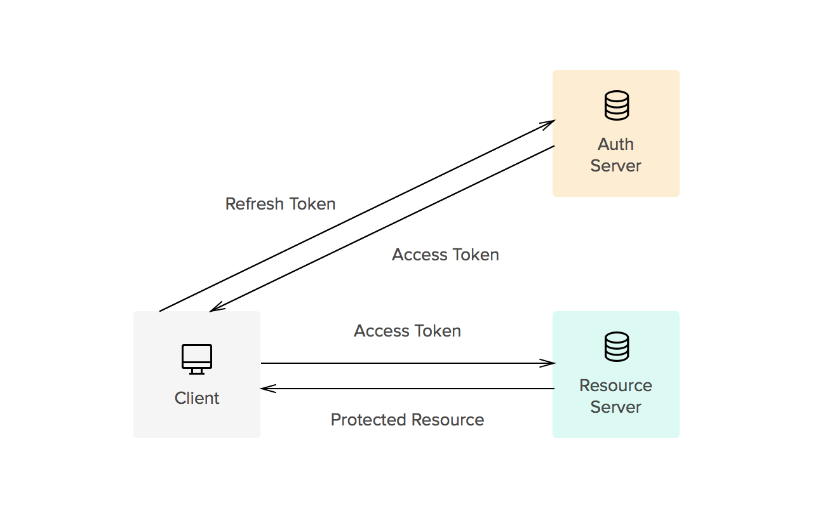

# Django JWT Authentication Tutorial

This tutorial will teach you about JWT authentication django rest framework

## How Access & Refresh Tokens Work

- For first time login
    - 

- When access token expires
    - 

- Making a request to a protected route
    - 

## Getting Started

### 2. Setting up a Django Project

- Create and enter the desired directory for project setup.

- Create a virtual environment using pipenv or other means:

    ```shell
    pip install pipenv
    pipenv shell
    ```

- pipenv de-activation and re-activation

- Install Django & Django rest framework

    ```shell
    pip install django djangorestframework
    ```

- Create a Django project called AuthenticationProject:

    ```shell
    django-admin startproject AuthenticationProject
    ```

- Create an app called Core:

    ```shell
    python manage.py startapp Core
    ```

- Open the project in your code editor.

- Add the app ```Core``` and ```rest_framework``` to project's ```INSTALLED_APPS``` settings.

- Create URLs for the app and register them in the project's URLs.

- Return "Hello World" from a view to test setup:
    - Create view
        ```python
        from rest_framework.response import Response
        from reest_framework.decorators import api_view

        @api_view(['GET'])
        def Home(request):

            return Response("Hello world")
        ```
    - Map view to url:

        ```python
        path('', views.Home),
        ```

- Create a superuser
    ```shell
    python manage.py createsuperuser
    ```

### 3. Install Simplejwt & Configure Token Endpoints

- Visit the documentation for Simple JWT: https://django-rest-framework-simplejwt.readthedocs.io/en/latest/getting_started.html

- Installing simplejwt:
    ```shell
    pip install djangorestframework-simplejwt
    ```

- Adding simplejwt to authentication classes:

    ```python
    REST_FRAMEWORK = {
        'DEFAULT_AUTHENTICATION_CLASSES': (
            'rest_framework_simplejwt.authentication.JWTAuthentication',
        )
    }
    ```

    Here we are trying to set simple jwt as the default authentication method

- Setup access and refresh token endpoints:
    - Head to your ```urls.py``` file in app folder and add the following:
        ```python
        from rest_framework_simplejwt.views import (
            TokenObtainPairView,
            TokenRefreshView,
        )

        urlpatterns = [
            path('api/token/', TokenObtainPairView.as_view(), name='token_obtain_pair'),
            path('api/token/refresh/', TokenRefreshView.as_view(), name='token_refresh'),
        ]
        ```
    - Test these endpoints in your browser or postman to get access and refresh tokens

### 4. Configuration for Simplejwt

- Head to settings page on documentation 
- Copy the ```SIMPLE_JWT``` configuration and paste in ```settings.py```   file
- Remove ```SIGNING_KEY```  as it is not needed
- Customising the lifetime of tokens
- Rotating refresh token
    - This helps to always generate a new refresh token every time a new access token is generated

    - Set the ```ROTATE_REFRESH_TOKEN``` to ```True```

    - Make a request to the refresh token endpoint to view result

- Blacklisting refresh tokens to prevent re-use
    - Set ```BLACKLIST_AFTER_ROTATION``` to ```True```
    - Next according to documentation, we need to add the following to installed apps:
        ```python
        'rest_framework_simplejwt.token_blacklist',
        ```
    - Run migrate:
        ```shell
        python manage.py migrate
        ```
    - Make a request to the refresh token endpoint to view result

### 5. Returning User Data Along With Tokens

- Create a serializer class for user
    - Create a ```serializers.py``` file in app folder
    - Make required imports:
        ```python
        from rest_framework.serializers import ModelSerializer
        from django.contrib.auth.models import User

        class UserSerializer(ModelSerializer):
            class Meta:
                model = User
                fields = '__all__'
        ```

- Override the default token obtain view in ```views.py``` file:
    ```python
    from django.contrib.auth.models import User
    from .serializers import UserSerializer
    from rest_framework_simplejwt.views import TokenObtainPairView
    from rest_framework_simplejwt.serializers import TokenObtainPairSerializer


    class MyTokenObtainPairView(TokenObtainPairView):
        serializer_class = TokenObtainPairSerializer
    
        def post(self, request, *args, **kwargs):

            # Proceed with the parent method to handle token generation
            try:
                response = super().post(request, *args, **kwargs)
            except TokenError as e:
                raise InvalidToken(e.args[0])

            # get username from form submission
            username = request.POST.get('username')
            if username:
                # Add user details to the response

                user = User.objects.get(username=username)
                user_serializer = UserInfoSerializer(user)
                response.data['user'] = user_serializer.data

            return response
    ```

- Change url mapping to new view in ```urls.py``` file:

    ```python
    path('api/token/', MyTokenObtainPairView.as_view(), name='token_obtain_pair'),
    ```

- Test the code